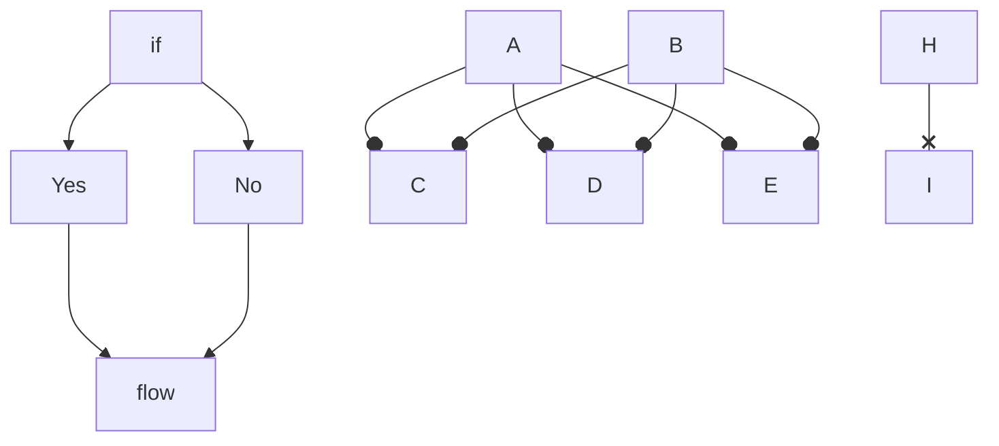

# header

## header2

- list
- list2
  1. fdsa
  2. number

```dart
void main() {}

```

`fas` *fasf* **fdasf**

branch`work`を作りました。



::: mermaid
graph TD;
    A-->B;
    A-->C;
    B-->D;
    C-->D;
:::

